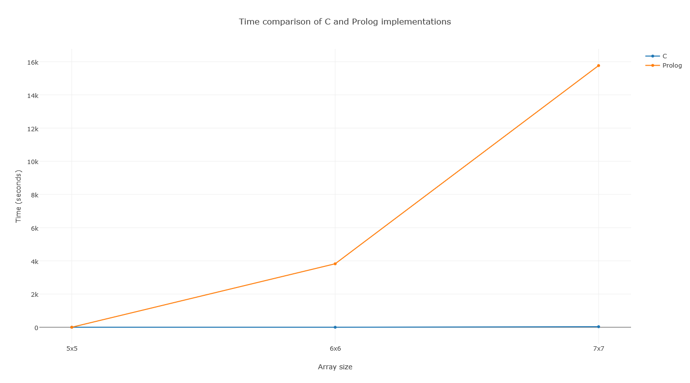

# Latin Square
Implementations in Prolog and C for latin squares and then comparison of execution times in different sizes.

# Compiling
> gcc -o ls latinsquare.c

# Running
## C
> ./ls size (Ex.: size = 2 is 2x2 matrix)

## PROLOG
> Open archive and run rule "run"

# Considerations
* In C implementation, the time to archive sucess is slower after 7x7.
* In Prolog implementation, the time to archive sucess is slower after 6x6
* We use an normalizated table, that is, first row and column has (1,2,...,size) as values.
* The output file for 7x7 (C) has more than 300 MB, for this reason we cant upload this files.
* The output for prolog implementation is also unavailable

# Graphs

